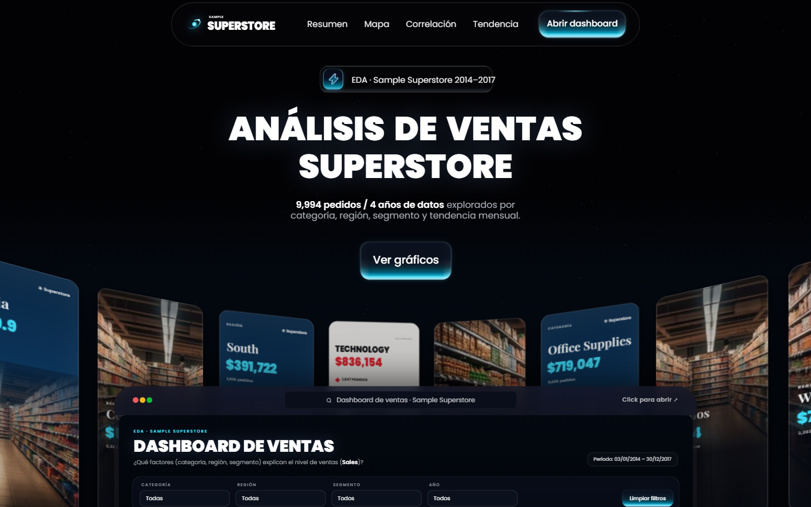
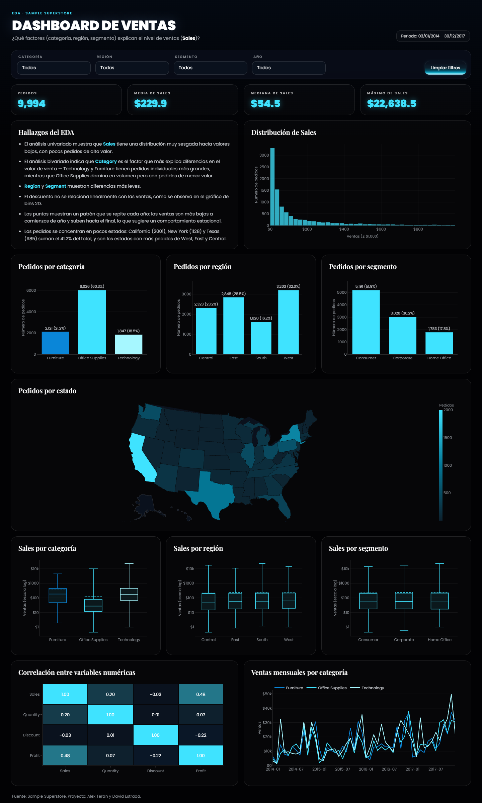

# Dashboard Sample Superstore — 3D

Dashboard web 3D del dataset Sample Superstore.





- `index.html`: página principal (antes `3DWebDashboard.html`).
- `Dashboard Superstore.dc.html`: dashboard embebido en la página principal.
- `dashboard_data.html`: figuras y datos (JSON) que carga el dashboard.
- `support.js`, `assets/`, `favicon.ico`: recursos de la página (capturas en `assets/screenshots/`).

Para verlo localmente, sirve la carpeta con cualquier servidor estático, por ejemplo:

```
python -m http.server 8000
```

y abre http://localhost:8000/.
